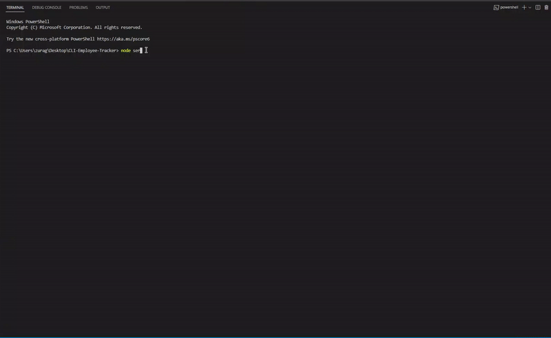

# CLI-Employee-Tracker

## Description 

This project aims to showcase my ability in utilizing MySQL, Inquirer, and Node.js to create a command-line application to manage a company's employee database.




## Usage

In order to do this project, I used the `mysql2` library to handle writing and reading to a database. I also used the `console.table` library to format tables in the command line console.


```JavaScript
// Connect to database
const db = mysql.createConnection(
    {
        host: 'localhost',
        user: 'root',
        password: 'password',
        database: 'employees_db'
    },
    console.log(`Connected to the employees_db database.`)
);

function viewRoles() {
    db.query('SELECT role.id, role.title, department.name, role.salary FROM role INNER JOIN department ON department.id = role.department_id ORDER BY role.id ASC', function (err, results) {
        console.log("\n");
        console.log(err);
        console.table(results);
        mainPrompt();
    });
}
```

## Links

There is no deployed link but demo video available [here](https://www.youtube.com/watch?v=oRfyRJVhTEs).

[Project Repository](https://github.com/zzzorigtbaatar/CLI-Employee-Tracker)

## Credits

* Jerome Chenette, UC Berkeley Extension Coding BootCamp

* https://www.npmjs.com/package/mysql2

* https://www.npmjs.com/package/console.table

## License

[LICENSE](/LICENSE)

## Contact

https://www.linkedin.com/in/zorizulkhuu/

https://github.com/zzzorigtbaatar